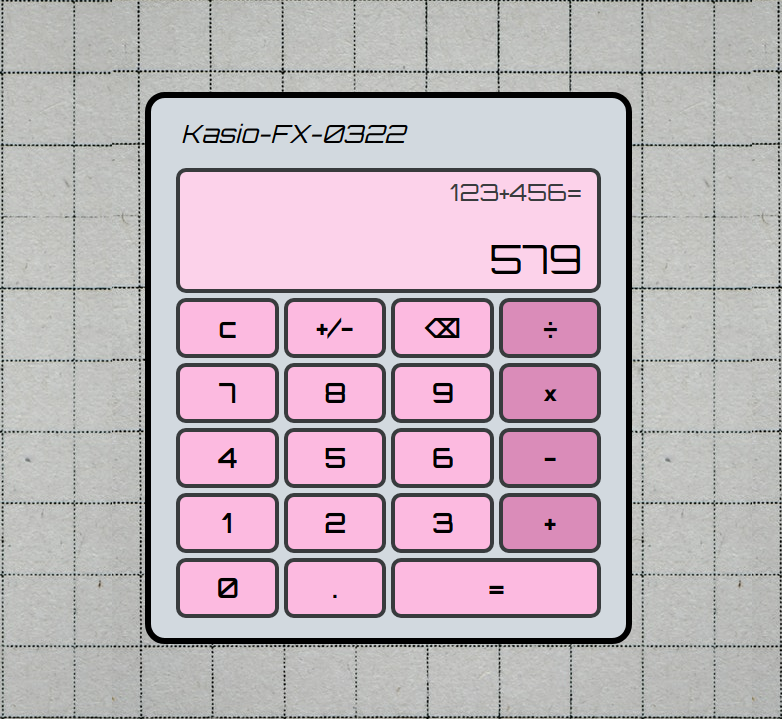

# Calculator
- This is a web-based calculator project I made using vanilla JavaScript, HTML and CSS. I was able to utilize CSS grids and JavaScript event handlers.

### What's inside

### Special thanks to: 
- [Photo](https://www.pexels.com/photo/pattern-texture-wall-abstract-7598077/) by Eva Elijas from Pexels
